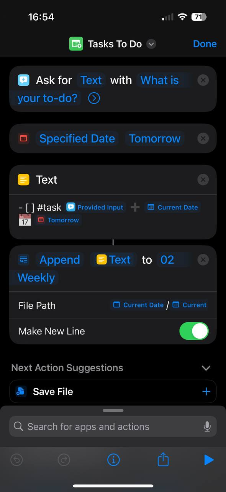
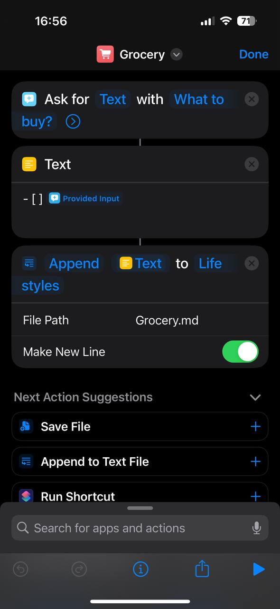

Obsidian과 함께한 여정이 일년이 조금 넘었네요! 1년 전 엄청난 이 노트앱을 발견, 제 일상의 생산성과 조금 더 계획된 일상을 보낼 수 있게 도와 주고 있습니다. Markdown, 그리고 커뮤니티 플러그인들은 옵시디안을 더욱 더 재미있고 유연하게 해주는 것 같고, 모든 사람들이 알았으면 좋겠어요! 옵시디안 관련 글은 한국어로도 적어보려 합니다. 

이 블로그에서, 제가 어떻게 아이폰 단축어를 설정해서 Obsidian에 노트를 작성하고 할 일을 추적하는지 공유하려고 합니다. 지금까지 6개월 동안 아주 잘 쓰고 있는 기능이며, 이 방법은 r/Obsidian 서브레딧을 통해 발견했어요!, 역시 커뮤니티 베이스가 짱인거 같아요. 

<!-- more -->

## 평소 Obsidian을 어떻게 쓰는가

먼저, 아이폰 단축어로 뭘 해서 옵시디안을 쓰고있는지 보여주기위해, 제 Obsidian 설정부터 간략하게 말씀드리자면:

- 저는 [Obsidian periodic notes 플러그인](https://github.com/liamcain/obsidian-periodic-notes)과 [templater 플러그인](https://silentvoid13.github.io/Templater/introduction.html)을 이용해 **주간 노트 (Weekly notes)**를 만듭니다.
- 주간 노트에서, 제 To-do 들(지난 기한/오늘 기한/이번 주 기한)이 [obsidian-task 플러그인](https://publish.obsidian.md/tasks/Introduction)과 [dataview 플러그인](https://github.com/blacksmithgu/obsidian-dataview)으로 나타납니다.
- 제 아이폰과 맥을 동기화하기 위해 아이클라우드를 사용하고 있습니다

평소 옵시디안을 어떻게 사용하나면: 

- **무언가를 해야 한다**고 생각이 들 때마다, 그것을 기한과 함께 주간 노트에 적습니다.
- **무작위 생각**들도 주간 노트에 적습니다.
- 매주 주말마다 일주일 동안 필요한 식료품 쇼핑을 위한 **식료품 목록** 노트 (간단한 할 일 형식)
- 콘텐츠 아이디어를 기억하기 위한 **콘텐츠 목록** 노트

## 그러나
일주일 동안 해야 할 일들을 주간 노트에 적어두고 리뷰 하는 아이디어에 만족했지만, 문제가 있었어요. 

갑자기 새로운 할 일이 생기거나, 무작위로 생각이 떠오르거나, 식료품 목록을 업데이트해야 할 때마다 제 아이폰에서 Obsidian 앱을 실행해야 했어요. 이 과정은 시간이 좀 걸리는데, 주간 노트를 클릭하고 `- [ ] ...`를 타이핑해야 했어요. 이런 작은 할 일들을 위해 이런 번거로운 작업을 해야 한다는 것이 너무 귀찮아서, 결국 노트를 적는 것을 포기할 때가 많았고 결국 또 계획과 구조없는 일상의 반복...

Obsidian 노트에 더 빠르게 접근하고 생각을 즉석에서 적을 수 있는 방법을 찾아보던중, '아이폰 단축어' 를 발견!

## iOS 단축어
[Shortcuts, 단축어](https://support.apple.com/en-au/guide/shortcuts/apdf22b0444c/ios)는 애플이 개발한 시각적 스크립팅 어플리케이션으로, 애플 생태계(Mac, iPhone 등) 전체에서 사용할 수 있어요. 앱등이 13년 생활 이 기능을 이제서야 쓰게되다니! 자동화와 스크립팅 능력의 완벽한 조합입니다. 그리고 Obsidian의 유연성까지!

## 나의 단축어 1. 할 일을 주간 노트로

단축어를 통해 할 일 목록을 쉽게 **Obisidian을 열지 않고도** 추가할 수 있어요.

1. "What is your to-do?"라는 문구로 텍스트를 요청해요.
2. 데이터로 주입하기 위해 'tomorrow' 변수를 가져와요 (저는 [obsidian-task 플러그인](https://publish.obsidian.md/tasks/Introduction)을 사용하고 만기일별로 to-do를 정렬해놔요)
3. `-[]`와 `#task`를 포함한 텍스트와 내일의 날짜를 만기일로, 현재 날짜를 캡처해요
4. 캡처된 텍스트를 `YYYY`/`YYYY-[W]ww` 경로에 새로운 줄로 추가해요 (앞에서 말씀드렸다 시피, 저는 [periodic notes 플러그인](https://github.com/liamcain/obsidian-periodic-notes)을 사용해서 주간 노트를 설정해요)

## My Shortcuts 2. 식료품 쇼핑 아이디어를 식료품 메모에

여기서도 같은 로직이 적용되고, 그냥 정적 파일에 텍스트를 넣는거라서 할 일 목록보다 더 간단해요.

1. "what to buy?"라고 텍스트를 요청한 후에, 
2. `-[]`를 포함한 텍스트를 캡쳐하고,
3. 캡처된 텍스트를 `Grocery.md` 파일에 추가. 끗. 

## Closing 

어떠세요? 코드 한 줄 없이 누구나 설정할 수 있는 초간단 자동화라고 자신있게 소개합니다ㅎㅎㅎ 이 작은 팁이 여러분들의 일상 생산성을 향상시키는 데 도움이 되길 바라면서, 다른 팁들 있으시면 댓글 달아주세요!