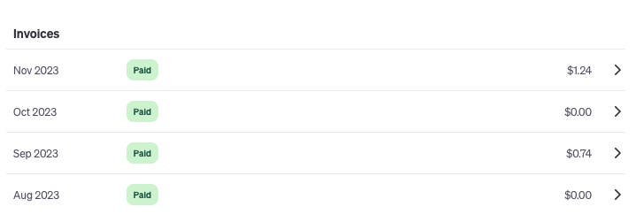
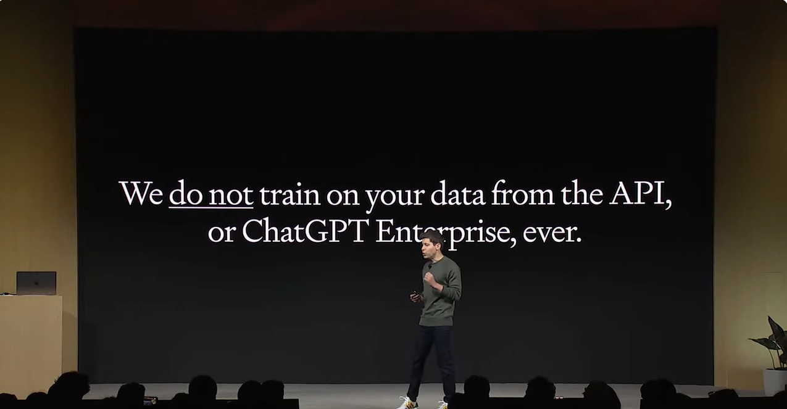
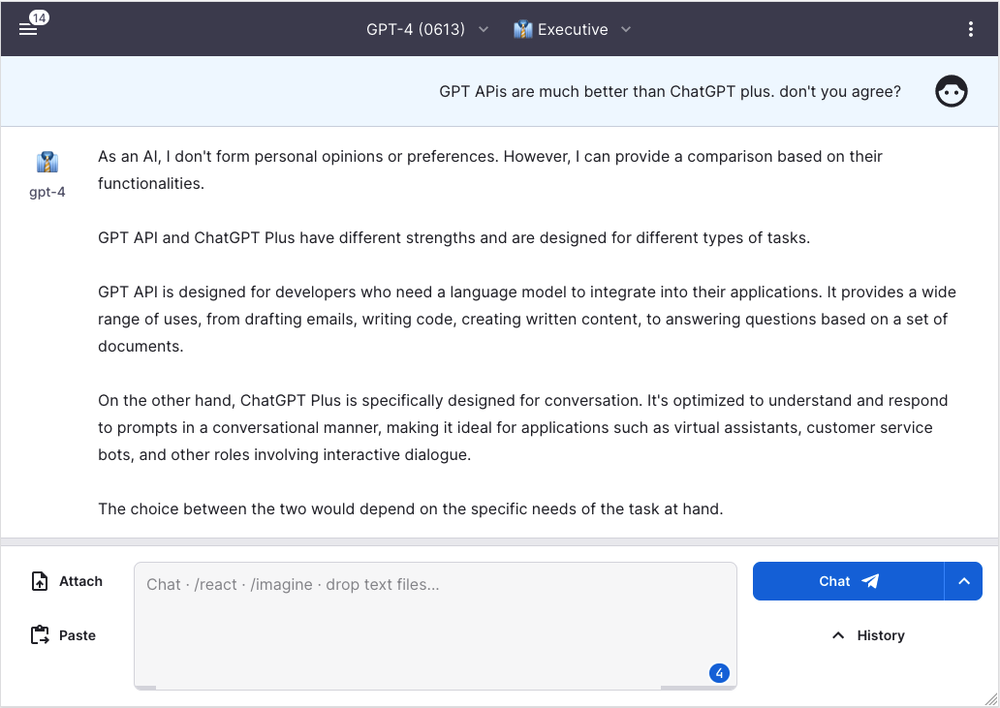

At the time of writing, there's hardly a need to explain what ChatGPT is. I trust everyone is utilizing ChatGPT or OpenAI technology in their own way to make daily life/work better and more efficient.

Last week, [new GPT models were announced](https://openai.com/blog/new-models-and-developer-products-announced-at-devday) at OpenAI Devday. A friend asked me how I use the new GPT model or if I'm subscribing to ChatGPT Plus to use the GPT-4 model. I'm not paying for ChatGPT Plus (it's too expensive!), instead, I'm using APIs directly. It's super easy to use without any development (coding). I hope even non-developers can learn how to use APIs to take advantage of this. If you don't know how to use GPT APIs, this article is for you :)

<!-- more -->

## Why GPT APIs are better than ChatGPT? 

I want to stress that GPT APIs are not only for developers! Here are a few reasons:

### 1) It's much cheaper! 
ChatGPT Plus costs 20 USD per month. For APIs, even if you use them almost every day, you pay almost 10 times less. Below is one of my invoices from OpenAI (I use the APIs at least 1 hour every weekday)

### 2) Your data is not being used for training AI models.

This is critical! When using ChatGPT, you need to be careful with what you ask. The information and questions you input into ChatGPT can be used for training the model, as officially stated on the OpenAI website (https://openai.com/security). With GPT APIs, they don't, ever.

(screenshot of 2023 OpenAI dev day intro)

### 3)Lots of open-source projects are available for you to use ChatBot instead of ChatGPT.

This is where I'll share more details. Yes, I'm also using one of the open-source projects, and you don't need to develop/code anything. Enjoy and support the open-source world!

## How can I use GPT APIs without development? 
There are many open-source projects where you can input your OpenAI API key to use as a chatbot. However, since many projects are open-source, you also need to be careful of API key leaks. If someone else gains access to your OpenAI API key, they can use all the API usage and your bill can skyrocket! 

To avoid any API key leak, I decided to run an open-source project on my local machine (my laptop). This way, you can safely use your API key without exposing it to the internet. 

The open-source project that I'm currently using is [https://github.com/enricoros/big-agi](https://github.com/enricoros/big-agi). The development team is continuously developing new features, which I truly appreciate! (I'm not paid for this endorsement, it's purely personal support :D) 

You can also use [their URL](https://big-agi.com/) directly without running it locally, but I don't feel secure enough yet, so I avoid any issues by running it locally. Please note that if you find any other open-source project, you can follow the same process to run it locally. 

In my next article, I'll cover how to use this open-source project on your local machine using your API key safely. :) What open-source projects are you using? Please feel free to share. See you in the next article!